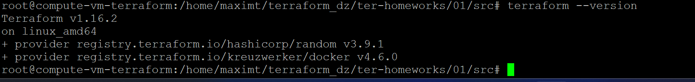

# Введение в Terraform

## Чек-лист

Terraform v1.16.2:



## Задание 1

**1.** `terraform init` — провайдеры random и docker скачались (через зеркало).

**2.** Секреты можно хранить в `personal.auto.tfvars` (он в `.gitignore`).

**3.** Секрет из state: `"result": "gc2Qj16Zt24ZvdqV"`

**4.** После `terraform validate` нашёл 4 ошибки:
- `resource "docker_image" {` — нет имени → `"docker_image" "nginx"`
- `"1nginx"` — имя не может начинаться с цифры → `"nginx"`
- `random_string_FAKE` — нет такого ресурса → `random_string`
- `.resulT` — неверный атрибут → `.result`

После правок: `Success! The configuration is valid.`

**5.** Исправленный фрагмент:

```hcl
resource "docker_image" "nginx" {
  name         = "nginx:latest"
  keep_locally = true
}

resource "docker_container" "nginx" {
  image = docker_image.nginx.image_id
  name  = "example_${random_password.random_string.result}"

  ports {
    internal = 80
    external = 9090
  }
}
```

`docker ps`:

```
CONTAINER ID   IMAGE          COMMAND                  STATUS         PORTS                  NAMES
2364d4eb8a97   05b8cb60c354   "/docker-entrypoint.…"   Up 4 seconds   0.0.0.0:9090->80/tcp   example_gc2Qj16Zt24ZvdqV
```

**6.** Поменял имя контейнера на `hello_world`, `terraform apply -auto-approve`.

Опасность `-auto-approve`: пропускает подтверждение плана, можно случайно снести/пересоздать ресурсы. Нужен для автоматизации — скрипты и CI/CD, где нажать `yes` некому.

`docker ps`:

```
CONTAINER ID   IMAGE          COMMAND                  STATUS        PORTS                  NAMES
eb5e82de7fce   05b8cb60c354   "/docker-entrypoint.…"   Up 9 seconds  0.0.0.0:9090->80/tcp   hello_world
```

**7.** `terraform destroy` → `Resources: 3 destroyed`. terraform.tfstate:

```json
{
  "version": 4,
  "terraform_version": "1.16.2",
  "serial": 11,
  "lineage": "66812f29-b784-0c59-c2fc-35cb286d5844",
  "outputs": {},
  "resources": [],
  "check_results": null
}
```

**8.** Образ `nginx:latest` не удалился из-за `keep_locally = true` в `docker_image`.

Из документации:
> `keep_locally` (Boolean) If true, then the Docker image won't be deleted on destroy operation.

## Задание 2*

Terraform с рабочей станции управляет docker на ВМ через SSH (`host = "ssh://..."`). Поднял `mysql:8`, пароли через `random_password`. Код: [`task2/main.tf`](task2/main.tf).

Проверка env в контейнере — пароли разные, всё прокинулось:

```
MYSQL_ROOT_PASSWORD=YZHprvSwolCxHSAe
MYSQL_PASSWORD=cfZiCqj8TSIfqwbW
MYSQL_USER=wordpress
MYSQL_DATABASE=wordpress
MYSQL_ROOT_HOST=%
```

Ресурсы и ВМ потом удалил.
