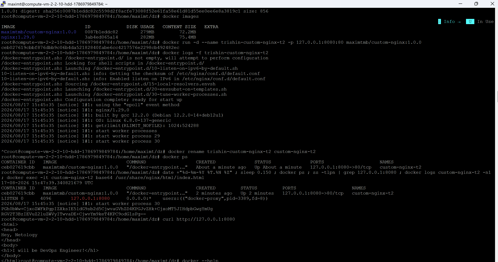
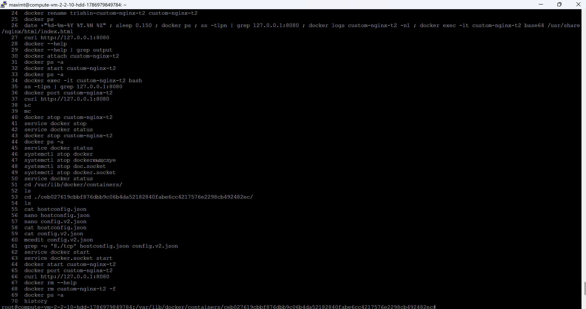
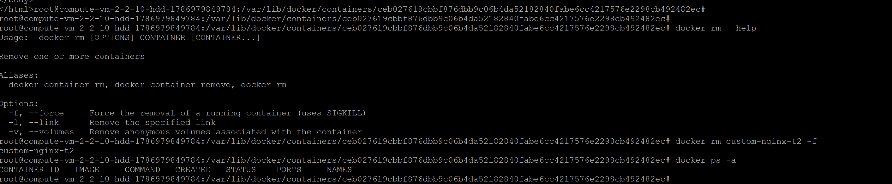
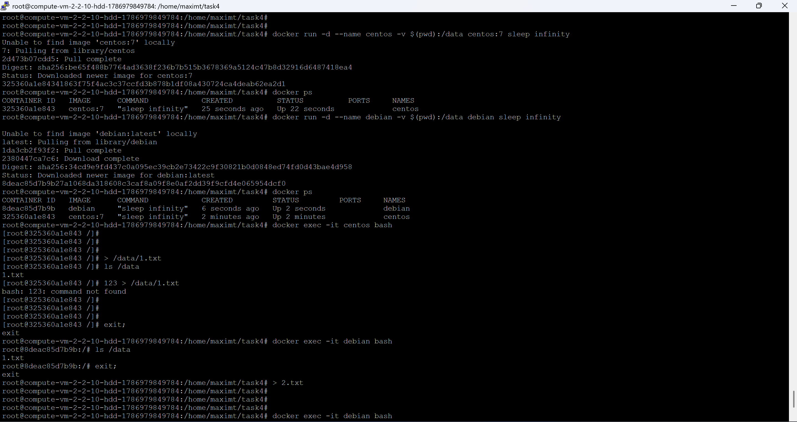
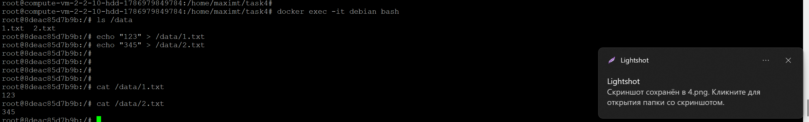
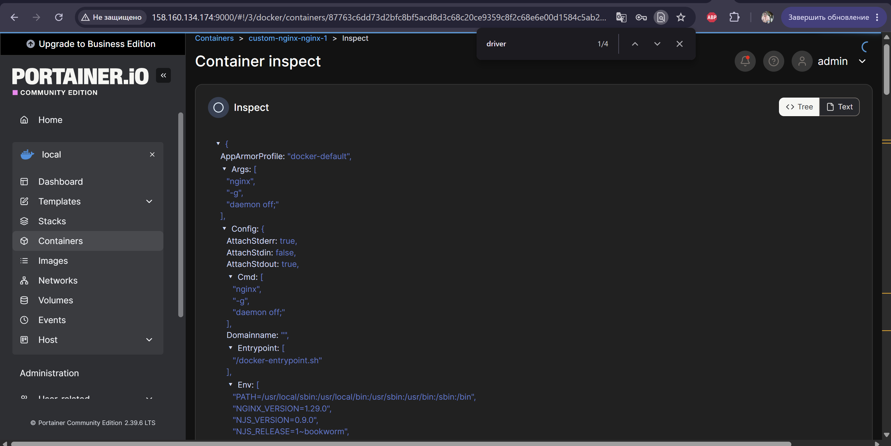
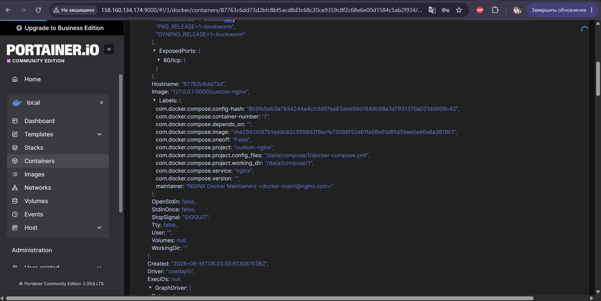

# Домашнее задание «Docker Compose»

## Задача 1

Dockerfile:

```dockerfile
FROM nginx:1.29.0
COPY index.html /usr/share/nginx/html/index.html
```

index.html:

```html
<html>
<head>
Hey, Netology
</head>
<body>
<h1>I will be DevOps Engineer!</h1>
</body>
</html>
```

```bash
docker build -t maximtmb/custom-nginx:1.0.0 .
docker push maximtmb/custom-nginx:1.0.0
```

https://hub.docker.com/r/maximtmb/custom-nginx/general

## Задача 2

```bash
docker run -d --name trishin-custom-nginx-t2 -p 127.0.0.1:8080:80 maximtmb/custom-nginx:1.0.0
docker rename trishin-custom-nginx-t2 custom-nginx-t2
```



## Задача 3

Контейнер остановился, потому что через attach мы подключились к главному процессу (nginx, PID 1), а Ctrl-C его завершил. Контейнер живёт пока жив главный процесс.

Проблема (п.10): порт проброшен на 80 (`-p 127.0.0.1:8080:80`), а nginx после правки конфига слушает 81. На 80 никто не отвечает — `Connection reset by peer`.

П.11: порт правится в `hostconfig.json` и `config.v2.json` в `/var/lib/docker/containers/<id>/` при остановленном докере.

```bash
docker rm custom-nginx-t2 -f
```




## Задача 4

```bash
docker run -d --name centos -v $(pwd):/data centos:7 sleep infinity
docker run -d --name debian -v $(pwd):/data debian sleep infinity
```

Каталог примонтирован в оба контейнера, файлы видны в обоих.




## Задача 5

П.1 — запустился `compose.yaml`, у него приоритет выше, чем у `docker-compose.yaml`.

П.2 — через `include`:

```yaml
services:
  portainer:
    network_mode: host
    image: portainer/portainer-ce:latest
    volumes:
      - /var/run/docker.sock:/var/run/docker.sock
include:
  - docker-compose.yaml
```

П.3:

```bash
docker tag maximtmb/custom-nginx:1.0.0 127.0.0.1:5000/custom-nginx:latest
docker push 127.0.0.1:5000/custom-nginx:latest
```

П.7 — после удаления `compose.yaml` вышел warning про orphan-контейнер (portainer больше нет в конфиге):

```bash
docker compose up -d --remove-orphans
docker compose down
```



